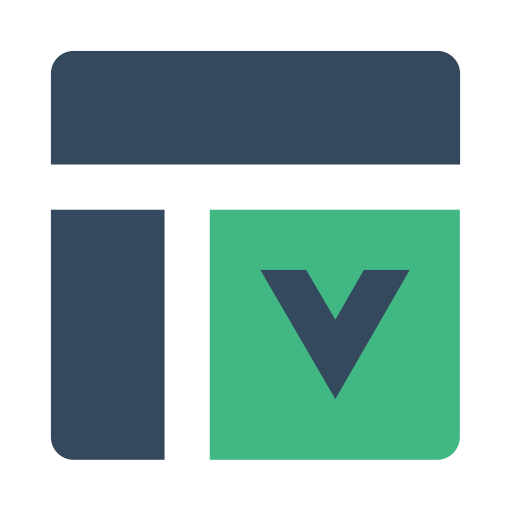

<p align="center">
  
</p>

<h2 align='center'>vite-plugin-slots-layouts</h2>

<p align="center">Vite 中 Vue 3 的基于插槽的布局系统 <strong>WIP</strong>
</p>

[English](./README.md) | 简体中文

## 安装

```bash
pnpm i -D vite-plugin-slots-layouts
```

## 使用

```ts
// vite.config.ts
import { defineConfig } from "vite";
import Layout from "vite-plugin-slots-layouts";

export default defineConfig({
  plugins: [Layout()],
});
```

在 main.ts 中需要导入生成的代码并调用 `app.use()`

```ts
// main.ts
import App from "./App.vue";
import layouts from "virtual:slots-layouts";
const app = createApp(App);

app.use(layouts);
```

## 客户端类型

```ts
/// <reference types="vite-plugin-slots-layouts/client" />
```

## 配置

查看 [types.ts](./src/types.ts)

## 布局块

使用布局块可以设置页面的布局

```vue
<layout name="blog" disabled lang="jsonc">
{
  ":isPost": false,
  "v-bind": "obj",
  "@change": "handleLayoutChange"
}
</layout>
```

### 属性

- `name`: 设置布局
- `disabled`: 禁用布局

### 内容

内容是 JSON 字符串, 可以使用 Vue 支持的模板语法

```vue
<layout-blog
  :isPost="false"
  v-bind="obj"
  @change="handleLayoutChange"
></layout-blog>
```

## 原理

注册 layout 文件夹的组件

- blog/index.vue
  - component: `<layout-blog/>`
  - layout: `blog`
- blog/header-and-footer.vue
  - component: `<layout-blog-header-and-footer/>`
  - layout: `blogHeaderAndFooter`

读取页面中的 layout-block

```html
<layout name="blog"></layout>
```

替换页面的 template 并使用布局组件包裹

之前:

```html
<!-- default.vue -->
<template>
  <slot />
  <slot name="footer"> default footer </slot>
</template>
```

```html
<!-- page.vue -->
<template>page</template>
<template #footer>footer</template>
<script lang="ts" setup>
  ...
</script>
```

之后:

```html
<template>
  <layout-default>
    <template #default>page</template>
    <template #footer>footer</template>
  </layout-default>
</template>
<script lang="ts" setup>
  ...
</script>
```

这意味着你可以完全灵活地使用插槽 API。
